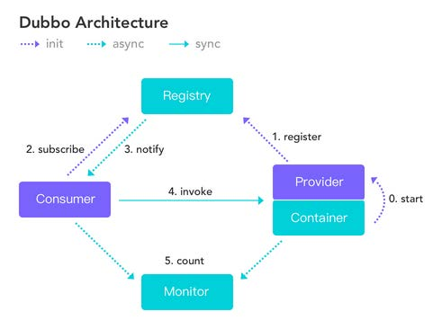
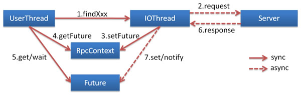
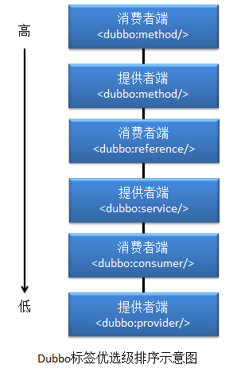

# Dubbo基础



**工作流程**（图中的编号并不一定是实际执行的先后顺序）：

问题：启动阶段Consumer订阅某个服务但是服务实例还没启动会发生什么？

> Apache Dubbo依赖Spring实现，借助Zookeeper实现分布式管理，使用Curator作为ZK客户端。


## 示例Dubbo程序

### Dubbo配置

#### 常用schema配置项

[schema配置参考手册](http://dubbo.apache.org/zh-cn/docs/user/references/xml/introduction.html)

需要注意的是有些配置是必填的，没有填写会报响应的错误。

+ [dubbo.application](http://dubbo.apache.org/zh-cn/docs/user/references/xml/dubbo-application.html) [provider&consumer]

  一个必填属性：

  name：用于注册中心计算应用之间的依赖关系。

  name不填的话，启动的时候会报`java.lang.IllegalStateException: Invalid name="org.apache.dubbo.config.ApplicationConfig#0" contains illegal character, only digit, letter, '-', '_' or '.' is legal.`这个异常。

  ```xml
  <dubbo:application name="service-provider"/>
  ```

  ```yml
  dubbo:
    application:
      name: service-provider
  ```

  > `dubbo.application`对应`ApplicationConfig`；同理：其他配置项目也有相应的配置类。后面配置类报错肯定是对应的配置有问题。

+ [dubbo.monitor](http://dubbo.apache.org/zh-cn/docs/user/references/xml/dubbo-monitor.html) [provider&consumer]

  监控中心配置。对应的配置类： `org.apache.dubbo.config.MonitorConfig`

+ [dubbo.module](http://dubbo.apache.org/zh-cn/docs/user/references/xml/dubbo-module.html) [provider&consumer]

  模块信息配置。对应的配置类 `org.apache.dubbo.config.ModuleConfig`

  一个必填属性：

  name: 当前模块名称，用于注册中心计算模块间依赖关系。和dubbo.application的name的区别？

+ [dubbo.registry](http://dubbo.apache.org/zh-cn/docs/user/references/xml/dubbo-registry.html) [provider&consumer]

  注册中心配置。对应的配置类： `org.apache.dubbo.config.RegistryConfig`。同时如果有多个不同的注册中心，可以声明多个 标签，并在<dubbo:service>或<dubbo:reference>的 `registry` 属性指定使用的注册中心。

  address="N/A"指不使用注册中心，搭配直连式连接服务提供者的配置使用。

  一个必填的属性：

  address：注册中心服务器地址，如果地址没有端口缺省为9090，同一集群内的多个地址用逗号分隔，如：ip:port,ip:port，不同集群的注册中心，请配置多个<dubbo:registry>标签。

  ```xml
  <!-- ZK单机版 -->
  <dubbo:registry address="zookeeper://zoo4:2184"/>
  <dubbo:registry protocol="zookeeper" address="zoo4:2184"/>
  <!-- ZK集群版 -->
  <dubbo:registry address="zookeeper://zoo4:2184?backup=zoo5:2185,zoo6:2186"/>
  ```

+ [dubbo.service](http://dubbo.apache.org/zh-cn/docs/user/references/xml/dubbo-service.html) [provider]

  服务提供者暴露服务配置。对应的配置类：`org.apache.dubbo.config.ServiceConfig`

  两个必填属性：

  interface: 暴露的服务的接口；

  ref: 服务对象实例引用。

+ [dubbo.protocol](http://dubbo.apache.org/zh-cn/docs/user/references/xml/dubbo-protocol.html) [provider]

  服务提供者协议配置。对应的配置类： `org.apache.dubbo.config.ProtocolConfig`。同时，如果需要支持多协议，可以声明多个标签，并在<dubbo:service>中通过 `protocol` 属性指定使用的协议。

  一个必填属性：

  name: 协议名称，默认`dubbo`。

+ [dubbo.provider](http://dubbo.apache.org/zh-cn/docs/user/references/xml/dubbo-provider.html) [provider]

  服务提供者缺省值配置。对应的配置类： `org.apache.dubbo.config.ProviderConfig`。同时该标签为 <dubbo:service> 和 <dubbo:protocol> 标签的缺省值设置。

+ [dubbo.reference](http://dubbo.apache.org/zh-cn/docs/user/references/xml/dubbo-reference.html)[consumer]

  消费者端引用服务配置。对应的配置类： `org.apache.dubbo.config.ReferenceConfig`；

  两个必填属性：
  
  id: 服务引用BeanId
  
  interface: 服务接口名

+ [dubbo.consumer](http://dubbo.apache.org/zh-cn/docs/user/references/xml/dubbo-consumer.html) [consumer]

  服务消费者缺省值配置。配置类： `org.apache.dubbo.config.ConsumerConfig` 。同时该标签为 <dubbo:reference> 标签的缺省值设置。

+ [dubbo:method](http://dubbo.apache.org/zh-cn/docs/user/references/xml/dubbo-method.html)

  方法级配置。对应的配置类： `org.apache.dubbo.config.MethodConfig`。同时该标签为 <dubbo:service> 或<dubbo:reference> 的子标签，用于控制到方法级。

  一个必填属性：

  name: 方法名。

  + [dubbo:argument](http://dubbo.apache.org/zh-cn/docs/user/references/xml/dubbo-argument.html)

    方法参数配置。对应的配置类： `org.apache.dubbo.config.ArgumentConfig`。该标签为 <dubbo:method>的子标签，用于方法参数的特征描述。

+ [dubbo:parameter](http://dubbo.apache.org/zh-cn/docs/user/references/xml/dubbo-parameter.html)

  选项参数配置。对应的配置类：`java.util.Map`。同时该标签为<dubbo:protocol>或<dubbo:service>或<dubbo:provider>或<dubbo:reference>或<dubbo:consumer>的子标签，用于配置自定义参数，该配置项将作为扩展点设置自定义参数使用。

+ [dubbo:config-center](http://dubbo.apache.org/zh-cn/docs/user/references/xml/dubbo-config-center.html) [provider&consumer]

  配置中心。对应的配置类：`org.apache.dubbo.config.ConfigCenterConfig`

#### 常用高级配置

参考：用户文档->示例。

##### 关闭服务检查

默认情况下，消费者启动会检查对应服务的提供者是否启动，未启动则会报异常。但是某种情况下可能存在循环消费的问题（虽然编码规范不允许这种情况出现），就需要关闭服务检查才能启动服务。

通过配置 `dubbo:reference`的`check`属性为false实现，或者配置注解 `@Reference(check = false)`。

##### 多版本控制

用于系统升级时实现"灰度发布"过程，即在低压力时段，让部分消费者先调用新的提供者实现类,其余的仍然调用老的实现类，在新的实现类运行没有问题的情况下，逐步让所有消费者全部调用成新的实现类。

通过配置 `dubbo:service`的`version`属性实现。

尝试使用注解实现却没有成功在一个应用中创建两个不同版本服务实例，使用xml配置@ImportResource注解可以实现（TODO: 注解方式失败是使用方式的原因么）。

##### 服务分组

用于针对不同的需求对同一个接口的不同实现。通过配置 `dubbo:service`的`group`属性实现。

比如用户群体分为普通用户和VIP用户，提供给他们的服务是不同的。

##### 多协议支持

除了`Dubbo`服务暴露协议（就是实现`RPC`的通信协议）外，还支持另外８种服务暴露协议；

详细参考[协议参考手册](http://dubbo.apache.org/zh-cn/docs/user/references/protocol/introduction.html),做了详细说明和性能对比。

| 协议类型   | 实现原理                                                     |
| ---------- | ------------------------------------------------------------ |
| dubbo      | Dubbo 缺省协议采用单一长连接和 NIO 异步通讯，适合于小数据量大并发的服务调用，以及服务消费者机器数远大于服务提供者机器数的情况。 |
| rmi        | RMI 协议采用 JDK 标准的 `java.rmi.*` 实现，采用阻塞式短连接和 JDK 标准序列化方式。 |
| hessian    | Hessian [[1\]](http://dubbo.apache.org/zh-cn/docs/user/references/protocol/hessian.html#fn1) 协议用于集成 Hessian 的服务，Hessian 底层采用 Http 通讯，采用 Servlet 暴露服务，Dubbo 缺省内嵌 Jetty 作为服务器实现。 |
| http       | 基于 HTTP 表单的远程调用协议，采用 Spring 的 HttpInvoker 实现 [[1\]](http://dubbo.apache.org/zh-cn/docs/user/references/protocol/http.html#fn1) |
| webservice | 基于 WebService 的远程调用协议，基于 [Apache CXF](http://cxf.apache.org/) [[1\]](http://dubbo.apache.org/zh-cn/docs/user/references/protocol/webservice.html#fn1) 的 `frontend-simple` 和 `transports-http` 实现 [[2\]](http://dubbo.apache.org/zh-cn/docs/user/references/protocol/webservice.html#fn2)。 |
| thrift     | 当前 dubbo 支持 [[1\]](http://dubbo.apache.org/zh-cn/docs/user/references/protocol/thrift.html#fn1)的 thrift 协议是对 thrift 原生协议 [[2\]](http://dubbo.apache.org/zh-cn/docs/user/references/protocol/thrift.html#fn2) 的扩展，在原生协议的基础上添加了一些额外的头信息，比如 service name，magic number 等。 |
| memcached  | 基于 memcached [[1\]](http://dubbo.apache.org/zh-cn/docs/user/references/protocol/memcached.html#fn1) 实现的 RPC 协议 [[2\]](http://dubbo.apache.org/zh-cn/docs/user/references/protocol/memcached.html#fn2)。 |
| redis      | 基于 Redis [[1\]](http://dubbo.apache.org/zh-cn/docs/user/references/protocol/redis.html#fn1) 实现的 RPC 协议 [[2\]](http://dubbo.apache.org/zh-cn/docs/user/references/protocol/redis.html#fn2)。 |
| rest       | 基于标准的Java REST API——JAX-RS 2.0（Java API for RESTful Web Services的简写）实现的REST调用支持。 |
| grpc       | Dubbo 自 2.7.5 版本开始支持 gRPC 协议，对于计划使用 HTTP/2 通信，或者想利用 gRPC 带来的 Stream、反压、Reactive 编程等能力的开发者来说， 都可以考虑启用 gRPC 协议。 |

##### 负载均衡

`Dubbo`可以针对接口和方法设置细粒度的负载均衡策略。

负载均衡策略：

+ **Random**（默认策略）

  按权重随机。

+ **RoundRobin**

  按权重轮询。

+ **LeastActive**

  最少活跃调用（能者多劳）。相同活跃数的随机，活跃数指调用前后计数差(计数差指的是正在处理的请求数量)。

  机器处理速度越慢活跃数越大，反而活跃数越小。

  > 每个服务维护一个活跃数计数器。当A机器开始处理请求，该计数器加1，此时A还未处理完成。若处理完毕则计数器减1。而B机器接受到请求后很快处理完毕。那么A,B的活跃数分别是1，0。当又产生了一个新的请求，则选择B机器去执行(B活跃数最小)，这样使慢的机器A收到少的请求。

+ **ConsistentHash**

  一致性 Hash，相同参数的请求总是发到同一提供者。

  当某一台提供者挂时，原本发往该提供者的请求，基于虚拟节点，平摊到其它提供者，不会引起剧烈变动。

> 负载均衡既可以设置到Provider也可以设置到Consumer。设置到Provider的话，Consumer可以通过注册中心获取到负载均衡策略存储到Consumer。
>
> 如果一个服务的多个不同的Provider设置的负载均衡策略不一样，后面注册的Provider负载均衡策略会把之前注册的Provider的负载均衡策略覆盖掉。
>
> 如果Consumer和Provider都设置了负载均衡策略，则以Consumer的负载均衡策略为准。

##### 集群容错

`Dubbo` 内置了 6 种集群容错策略。

通过`dubbo:service`和`dubbo:reference`分别在Provider和Consumer配置集群容错策略。

+ **Failover**(默认)

  失败自动切换，当出现失败，重试其它服务器 [[1\]](http://dubbo.apache.org/zh-cn/docs/user/demos/fault-tolerent-strategy.html#fn1)。通常用于读操作，但重试会带来更长延迟。可通过 `retries="2"` 来设置重试次数(不含第一次)。

+ **Failfast**

  快速失败，只发起一次调用，失败立即报错。通常用于非幂等性的写操作，比如新增记录。

  幂等：请求参数完全相同的前提下，请求一次和请求多次对系统的影响是相同的。

+ **Failsafe**

  失败安全，出现异常时，直接忽略。通常用于执行不太重要的服务，如写入审计日志等操作。

+ **Failback**

  失败自动恢复，后台记录失败请求，定时重发。通常用于消息通知操作。

+ **Forking**

  并行调用多个服务器，只要一个成功即返回。通常用于实时性要求较高的读操作，但需要浪费更多服务资源。可通过 `forks="2"` 来设置最大并行数。

+ **Broadcast**

  广播调用所有提供者，逐个调用，任意一台报错则报错 [[2\]](http://dubbo.apache.org/zh-cn/docs/user/demos/fault-tolerent-strategy.html#fn2)。通常用于通知所有提供者更新缓存或日志等本地资源信息。

##### 服务降级

服务降级的方式：

+ 部分服务降级
+ 全部服务暂停
+ 随机拒绝服务
+ 部分服务延迟

##### 服务限流

参考官方文档：用户文档->示例->并发控制／连接控制

+ **直接限流**（通过对连接数量直接进行限制来达到限流的目的。）

  + executes 限流（仅提供者端）

    可以设置为接口级别,也可以设置为方法级别。限制的是接口方法并发执行数量。

    通过`dubbo:service`和`dubbo:method`设置。

  + accepts 限流（仅提供者端）

    限制连接到提供者端的并发连接数量。

    通过`dubbo:provider`与`dubbo:protocol`设置。

  + actives 限流（提供者和消费者）

    可以设置为接口级别,也可以设置为方法级别。

    提供者端限流：
    长连接:表示当前长连接最多可以处理的请求个数。与长连接的数量没有关系。
    短连接:表示当前服务可以同时处理的短连接数量。

    消费者端限流：
    长连接:表示当前消费者所发出的长连接中最多可以提交的请求个数。与长连接的数量没有关系。
    短连接:表示当前消费者可以提交的短连接数量。

  + connections 限流（提供者和消费者）

    限定连接的个数。对于短连接,该属性效果与 actives 相同。但对于长连接,其限制的是长连接的个数。
    一般情况下,我们会使 `connectons `与 `actives` 联用,让 `connections` 限制长连接个数,让`actives` 限制一个长连接中可以处理的请求个数。联用前提:使用默认的 `Dubbo` 服务暴露协议。

+ **间接限流**（通过一些非连接数量设置来达到限制流量的目的）

  + 延迟连接

    仅可设置在消费者端,且不能设置为方法级别。仅作用于 `Dubbo` 服务暴露协议。
    将长连接的建立推迟到消费者真正调用提供者时。可以减少长连接的数量。

  + 粘连连接

    仅能设置在消费者端,其可以设置为接口级别,也可以设置为方法级别。仅作用于`Dubbo` 服务暴露协议。
    其会使客户端尽量向同一个提供者发起调用,除非该提供者挂了,其会连接另一台。只要启用了粘连连接,其就会自动启用延迟连接。

    其限制的是流向,而非流量。

  + 负载均衡

    其限制的是流向,而非流量。

##### 声明式缓存

通过`dubbo:reference`的`cache`属性配置。可以作用于接口（接口内所有方法结果都会缓存）也可以作用于方法。

默认可以缓存 1000 个结果（参数和结果的映射）。若超出 1000，将采用 LRU 策略来删除缓存,以保证最热的数据被缓存。注意该删除缓存的策略不能修改。

> 注意只适用于查询结果不会发生改变的情况,例如,查询某产品的序列号、订单、身份证号等。因为缓存不会根据数据自动更新。

##### 多注册中心

通过`dubbo:registry`设置。

一个服务可以注册到多个注册中心(比如多地多中心，各个地区调用本地区的注册中心，减少网络延迟)。`dubbo:reference`通过`registry`属性可以选择请求哪个注册中心的服务。

##### 单功能服务

+ **仅订阅**
  当前服务可以从注册中心下载注册列表,但其不会将自己的信息写入到注册列表。

  使用场景：

  比如开发阶段如果一个正在开发中的服务提供者注册，可能会影响消费者不能正常运行。

  可以让服务提供者开发方，只订阅服务(开发的服务可能依赖其它服务)，而不注册正在开发的服务，通过直连测试正在开发的服务。

+ **仅注册**

  仅仅将自己注册到注册中心，可被其他服务发现调用，但是自己不能从注册中心下载服务列表。

##### 服务暴露延迟

如果我们的服务启动过程需要 `warmup` ，就可以使用 `dubbo:service`的`delay` 进行服务延迟暴露。

其值可以有三类:
正数: 单位为毫秒,表示在提供者对象创建完毕后的指定时间后再发布服务。
0: 	  默认值,表示当前提供者创建完毕（当前服务本身的bean创建完毕）后马上向注册中心暴露服务。
-1: 	表示在 Spring 容器初始化完毕(所有bean初始化完毕)后再向注册中心暴露服务。

##### 消费者异步调用

针对耗时的`RPC`调用，采用异步调用的方式。

+ **Future异步调用**

  `UserThread`:　消费者线程
  `IOThread`:　提供者线程
  `Server`:　对 IO 型操作的真正执行者

  

  Future的特点是异步调用同步等待获取结果。**获取结果的过程仍然会导致阻塞**。

  Future异步调用适用于没有返回值的情况。

  通过消费者的`dubbo:reference`的子标签`dubbo:method`的`async`属性配置异步。

+ **CompletableFuture异步调用**

  针对Future异步调用的问题（使用 Future 的 get()方法获取返回值时被阻塞）`Dubbo` 又引入了 `CompletableFuture` 来实现对提供者的异步调用。

  `CompletableFuture`采用**异步回调**(消费者端需要注册回调方法)的方式（当结果返回，回调消费者的处理方法，而不是像Future傻傻地一次次询问有结果没）。

##### 提供者的异步执行

和消费者端的异步调用类似。通过`CompletableFuture`异步回调实现。

##### 属性配置优先级

这里的优先级指的是属性配置覆盖。

`Dubbo` 配置文件中各个标签属性配置的优先级总原则是:

１）方法级优先,接口级(服务级)次之,全局配置再次之。
２）如果级别一样,则消费方优先,提供方次之。



> 注意：
> `dubbo:consumer` 设置在消费者端，用于设置消费者端的默认配置，即消费者端的全局设置。
> `dubbo:provider`设置在提供者端，用于设置提供者端的默认配置，即提供者端的全局配置。

配置原则：

能同时在Provider和Consumer配置的属性，尽量优先在Provider配置。


### Dubbo管控中心

[Dubbo OPS](https://github.com/apache/incubator-dubbo-ops)

**部署**：

１）修改`dubbo-admin-server\src\main\resources\application.properties`中的ZK地址端口。

２）打包：进入根目录，`mvn clean package`。

３）启动：`java -jar dubbo-admin-distribution/target/dubbo-admin-0.1.jar`
