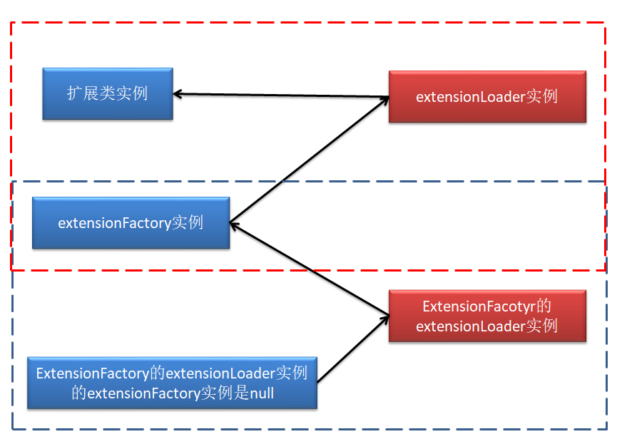

# Dubbo SPI 实现原理

Dubbo SPI 不仅提供了**SPI功能**，还提供了

Adaptive机制用于**动态选择拓展类**提供服务（基于@Adaptive注解的类或者@Adaptive注解的方法的生成类），

Wrapper机制用于**拓展类功能增强**（AOP的体现，基于装饰者模式），

Activate机制用于**拓展类标识、筛选、加载顺序控制**（基于＠Activate注解），是比Adaptive机制更灵活的一种**动态选择拓展类**的方式。


## Dubbo SPI 基础实现原理



上面其实就是说一个拓展类，通过其Factory类创建，但是拓展类和它的Factory类都需要通过ExtendLoader进行装载。

流程：先查SPI文件通过反射创建ExtensionFactory实例，然后ExtensionFactory实例再查SPI文件内部通过反射再创建拓展类实例。

**下面以通过 SPI 获取 Spring 容器的过程进行分析**：

```java
Main$main(args);
  ExtensionLoader<Container> loader = ExtensionLoader.getExtensionLoader(Container.class);
    ExtensionLoader.getExtensionLoader(Container.class)
      //先从EXTENSION_LOADERS（ConcurrentHashMap）中读取，没有则再创建
      ExtensionLoader<T> loader = (ExtensionLoader<T>) EXTENSION_LOADERS.get(type);
      if (loader == null) {
        //新建一个针对type类型的ExtensionLoader存入EXTENSION_LOADERS
        EXTENSION_LOADERS.putIfAbsent(type, new ExtensionLoader<T>(type));
          //type是否为ExtensionFactory.class，不是则先获取ExtensionFactory.class的ExtensionLoader,继而获取ExtensionFactory.class的实例，然后再通过ExtensionFactory获取拓展类的ExtensionLoader实例。
          this.type = type;
          objectFactory = (type == ExtensionFactory.class ? null : ExtensionLoader.getExtensionLoader(ExtensionFactory.class).getAdaptiveExtension());
        loader = (ExtensionLoader<T>) EXTENSION_LOADERS.get(type);
      }
      return loader;
```

getAdaptiveExtension()

```java
public T getAdaptiveExtension() {
  //先尝试从缓存中获取
    Object instance = cachedAdaptiveInstance.get();
    //缓存中没有，DCL保证线程安全的前提下反射新建
    if (instance == null) {
        ...
        synchronized (cachedAdaptiveInstance) {
            instance = cachedAdaptiveInstance.get();
            if (instance == null) {
                try {
                    //反射调用
                    instance = createAdaptiveExtension();
                    cachedAdaptiveInstance.set(instance);
                } catch (Throwable t) {
                    　...
                }
            }
        }
    }
    return (T) instance;
}
```
createAdaptiveExtension()
```java
private T createAdaptiveExtension() {
    try {
        return injectExtension((T) getAdaptiveExtensionClass().newInstance());
            //
            getAdaptiveExtensionClass()
                //先从缓存获取所有拓展类，为空的话，DCL保证线程安全前提下从SPI文件加载拓展类，然后放入缓存
                getExtensionClasses();
                    loadExtensionClasses();
                    cachedClasses.set(classes);
                if (cachedAdaptiveClass != null) {
                    return cachedAdaptiveClass;
                }
                //
                return cachedAdaptiveClass = createAdaptiveExtensionClass();
    } catch (Exception e) {
        ...
    }
}
```
loadExtensionClasses()
```java
private Map<String, Class<?>> loadExtensionClasses() {
    //缓存默认拓展类名（即@SPI value 指定的名字），对于ExtensionFactory.class是没有默认拓展类名的
    cacheDefaultExtensionName();
    //
    Map<String, Class<?>> extensionClasses = new HashMap<>();
    for (LoadingStrategy strategy : strategies) {
        loadDirectory(extensionClasses, strategy.directory(), type.getName(), strategy.preferExtensionClassLoader(), strategy.excludedPackages());
        loadDirectory(extensionClasses, strategy.directory(), type.getName().replace("org.apache", "com.alibaba"), strategy.preferExtensionClassLoader(), strategy.excludedPackages());
    }
    return extensionClasses;
}
```


## Adaptive机制

前面的案例，显示为了调用某个实现类的方法，需要先使用`ExtensionLoader`创建类加载器，**然后业务中通过某些逻辑选择名字加载指定的实现类并实例化**。然而这一操作代码（加粗部分）总是相同的能不能封装起来并且让他自动生成代码呢？所以就有了Adaptive机制。

Adaptive机制有两种使用方式，一个用于类上一个用于方法上；

**用于类上，就是通过这个类中实现的逻辑进行选择接口实现类**；

**用于方法上，会自动生成一个适配器类，里面实现通过URL参数选择接口实现类**。

### Adaptive机制原理

以Adaptive用于方法上的测试案例(kernel-adaptivemethod)分析：

```java
@Test
public void test2() throws SQLException {
    ExtensionLoader<Driver> loader = ExtensionLoader.getExtensionLoader(Driver.class);
    Driver driver = loader.getAdaptiveExtension();		//入口
    URL url = URL.valueOf("xxx://localhost/xxx?driver=mysql");
    System.out.println(driver.connect("", null, url));
}
```

`loader.getAdaptiveExtension()`会创建AdaptiveExtensionClass实例（自动生成AdaptiveExtensionClass代码并编译加载实例化）。

内部选择实现类的逻辑是通过url参数指定选取哪个实现类的，url没有指定则使用默认的。

生成的代码：

```java

```


## Wrapper机制

**包装和功能增强一样**，是AOP的体现，只不过基于装饰者模式而AOP基于动态代理，一个SPI可以在文件中指定多个Wrapper（前面的Wrapper被后面的Wrapper包装）。

Wrapper 类在定义时需要遵循如下规范:

+ 该类要实现 SPI 接口
+ 该类中要有 SPI 接口的引用
+ 在接口实现方法中要调用 SPI 接口引用对象的相应方法
+ 该类名称一般以 Wrapper 结尾(不是必需的)


## Activate机制

用于对拓展类进行**标识、筛选、加载顺序控制**，在@Activate 注解中共有五个属性,其中 before、after 两个属性已经过时,剩余有效属性还有三个。它们的意义为:

+ group: 为扩展类指定所属的组别,是当前扩展类的一个标识。String[]类型,表示一个扩展类可以属于多个
+ value: 为当前扩展类指定的 key,是当前扩展类的一个标识。String[]类型,表示一个扩展类可以有多个指定的 key。
+ order: 指定筛选条件相同的扩展类的加载顺序。序号越小,优先级越高。默认值为 0。


# Dubbo SPI处理原理

```
adaptive=org.apache.dubbo.common.extension.factory.AdaptiveExtensionFactory
spi=org.apache.dubbo.common.extension.factory.SpiExtensionFactory
spring=org.apache.dubbo.config.spring.extension.SpringExtensionFactory
```

+ **ExtensionLoader**

  ExtensionLoader 用于动态加载接口实现。Dubbo会为每一种接口创建一个ExtensionLoader实例，这个实例就专门负责选择性加载这个接口的所有实现类，所有ExtensionLoader实例会被存储到EXTENSION_LOADERS静态变量容器中。

  **ExtensionLoader加载接口实现分为两个阶段**：

  **阶段一**：（加载ExtensionFactory实现）

  先加载ExtensionFactory接口实现类（其实现类默认有SpiExtensionFactory和SpringExtensionFactory，用于引入Dubbo SPI 和 Spring对Bean的管理，加载的实现类会被缓存到ExtensionFactory为type创建的ExtensionLoader中，详细见下面说明），然后将这两个工厂提供给用户用于加载业务接口实现。

  1）首先去EXTENSION_LOADERS中查询ExtensionFactory类型的ExtensionLoader是否存在，不存在则创建然后加载并实例化ExtensionFactory的实现类。

  > ExtensionFactory实现类来源(依赖包或项目resources下)
  >
  > /META-INF/dubbo/internal/<接口名全路径> 
  >
  > /META-INF/dubbo/<接口名全路径>
  >
  > /META-INF/services/<接口名全路径>
  >
  > 如："META-INF/dubbo/internal/org.apache.dubbo.common.extension.ExtensionFactory"，
  >
  > "META-INF/dubbo/internal/com.alibaba.dubbo.common.extension.ExtensionFactory"（只是为了兼容旧版本dubbo）。

  **ExtensionLoader成员变量**

  ```java
  //表示此ExtensionLoader实例负责加载哪个接口的实现类
  type = {Class@1116} "interface org.apache.dubbo.common.extension.ExtensionFactory"
  //
  objectFactory = null
  //缓存加载过的实现类的名称
  cachedNames = {ConcurrentHashMap@1125}  size = 2
   {Class@1356} "class org.apache.dubbo.common.extension.factory.SpiExtensionFactory" -> "spi"
   {Class@1378} "class org.apache.dubbo.config.spring.extension.SpringExtensionFactory" -> "spring"
  //缓存加载过的实现类的Class
  cachedClasses = {Holder@1126} 
   value = {HashMap@1226}  size = 2
    "spring" -> {Class@1378} "class org.apache.dubbo.config.spring.extension.SpringExtensionFactory"
    "spi" -> {Class@1356} "class org.apache.dubbo.common.extension.factory.SpiExtensionFactory"
  //
  cachedActivates = {ConcurrentHashMap@1127}  size = 0
  //缓存实例化的实现类的实例
  cachedInstances = {ConcurrentHashMap@1128}  size = 2
   "spring" -> {Holder@1688} 
   "spi" -> {Holder@1770} 
  //缓存@Adaptive注释的实现类的实例
  cachedAdaptiveInstance = {Holder@1129} 
   value = {AdaptiveExtensionFactory@1469} 
  //缓存@Adaptive注释的实现类Class
  cachedAdaptiveClass = {Class@1343} "class org.apache.dubbo.common.extension.factory.AdaptiveExtensionFactory"
  cachedDefaultName = null
  createAdaptiveInstanceError = null
  cachedWrapperClasses = null
  exceptions = {ConcurrentHashMap@1130}  size = 0
  ```

- **AdaptiveExtensionFactory**

  

+ ExtensionFactory

+ SpiExtensionFactory

+ SpringExtensionFactory

  

#### java.net.URL


### Adaptive机制

+ @Adaptive注解修饰类

  被@Adapative 修饰的 SPI 接口扩展类称为 Adaptive 类,表示该 SPI 扩展类会按照该类中指定的方式获取,即用于固定实现方式。其是装饰者设计模式的应用。

  参考 org.apache.dubbo.common.extension.factory.AdaptiveExtensionFactory, org.apache.dubbo.common.compiler.support.AdaptiveCompiler 类的处理。

  

+ @Adaptive注解修饰方法

  被@Adapative 修饰 SPI 接口中的方法称为 Adaptive 方法。在 SPI 扩展类中若没有找到Adaptive 类,但系统却发现了 Adapative 方法,就会根据 Adaptive 方法自动为该 SPI 接口动态生成一个 Adaptive 扩展类,并自动将其编译。例如 Protocol 接口中就包含两个 Adaptive方法。

  参考 org.apache.dubbo.rpc.Protocol

  ```
  @Adaptive
  <T> Exporter<T> export(Invoker<T> invoker) throws RpcException;
  @Adaptive
  <T> Invoker<T> refer(Class<T> type, URL url) throws RpcException;
  ```


+ @Adaptive注解解析

  

#### Javaassist

能运行时动态生成、修改Class。

```java
// ClassPool包含所有动态生成的类，getDefault()返回默认的ClassPool，
ClassPool cp = ClassPool.getDefault();
// 动态生成一个类
CtClass gclazz = cp.makeClass("org.jamee.demo.javaassist.GeneratedClass");
CtMethod gmethod = CtMethod
.make("public void sayHello() { System.out.println(\"Hello Javaassist\"); }", gclazz);
gclazz.addMethod(gmethod);
// 转换成Class
Class<?> gc = gclazz.toClass();
// 将该CtClass从ClassPool中移除，
gclazz.detach();
// 调用方法
Object ginst = gc.newInstance();
Method gm = gc.getMethod("sayHello");
gm.invoke(ginst);
```

TODO：和JDK、Cglib的动态代理使用和实现过程比较一下(看看是不是把JDK那个动态生成代理类的过程封装成了javaassist)。