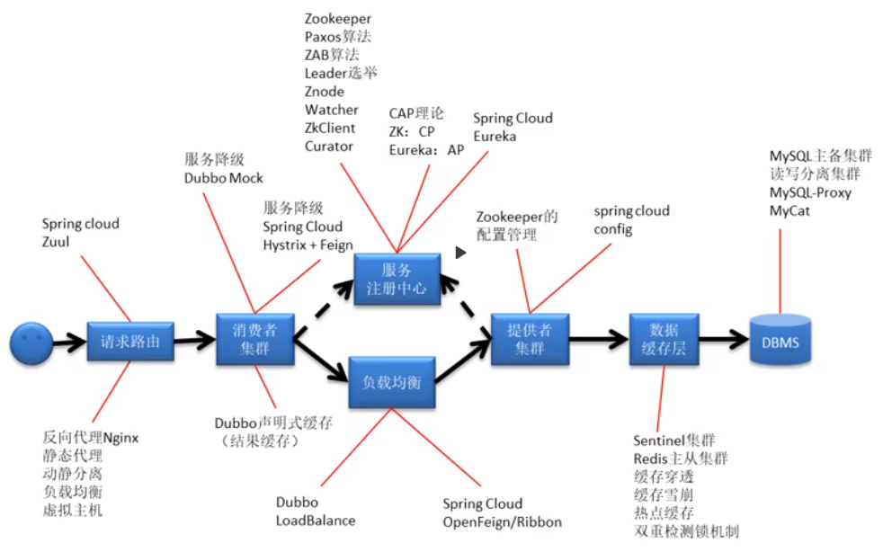

# Dubbo系统架构

[Dubbo 2.7.3 src](https://github.com/apache/dubbo/releases/tag/dubbo-2.7.3)

**分布式技术图谱**：



**Dubbo三大核心功能**：

+ RPC
+ 智能容错与负载均衡
+ 服务自动注册与发现


## 系统架构简介

### 设计原则 

+ **微内核+插件**

+ **采用URL作为配置信息的统一格式**

### 三大领域模型

+ **Protocol服务域**

+ **Invoker实体域**

  Provider的代理对象

+ **Invocation会话域**

### 四大组件

+ Registry

+ Consumer

+ Provider

+ Monitor


### 十层架构


#### Service 

+ **Interface**

  业务服务接口

+ **Implement**

  业务服务实现类

#### Config


#### Proxy


#### Registry


#### Cluster


#### Monitor


#### Protocol


#### Exchange


#### Transport


#### Serialize


### 源码结构

```txt
dubbo-dubbo-2.7.3/
├── CHANGES.md
├── CODE_OF_CONDUCT.md
├── codestyle
│   ├── checkstyle-suppressions.xml
│   ├── checkstyle.xml
│   ├── dubbo_codestyle_for_idea.xml
│   └── manage_profiles.png
├── CONTRIBUTING.md
├── dubbo-all
│   └── pom.xml
├── dubbo-bom
│   └── pom.xml
├── dubbo-cluster
│   ├── pom.xml
│   └── src
├── dubbo-common
│   ├── pom.xml
│   └── src
├── dubbo-compatible
│   ├── pom.xml
│   ├── README.md
│   └── src
├── dubbo-config
│   ├── dubbo-config-api
│   ├── dubbo-config-spring
│   └── pom.xml
├── dubbo-configcenter
│   ├── dubbo-configcenter-api
│   ├── dubbo-configcenter-apollo
│   ├── dubbo-configcenter-consul
│   ├── dubbo-configcenter-etcd
│   ├── dubbo-configcenter-nacos
│   ├── dubbo-configcenter-zookeeper
│   └── pom.xml
├── dubbo-container
│   ├── dubbo-container-api
│   ├── dubbo-container-log4j
│   ├── dubbo-container-logback
│   ├── dubbo-container-spring
│   └── pom.xml
├── dubbo-demo
│   ├── dubbo-demo-annotation
│   ├── dubbo-demo-api
│   ├── dubbo-demo-interface
│   ├── dubbo-demo-xml
│   ├── pom.xml
│   └── README.md
├── dubbo-dependencies
│   ├── dubbo-dependencies-zookeeper
│   └── pom.xml
├── dubbo-dependencies-bom
│   └── pom.xml
├── dubbo-distribution
│   ├── pom.xml
│   └── src
├── dubbo-filter
│   ├── dubbo-filter-cache
│   ├── dubbo-filter-validation
│   └── pom.xml
├── dubbo-metadata-report
│   ├── dubbo-metadata-definition
│   ├── dubbo-metadata-definition-protobuf
│   ├── dubbo-metadata-report-api
│   ├── dubbo-metadata-report-consul
│   ├── dubbo-metadata-report-etcd
│   ├── dubbo-metadata-report-nacos
│   ├── dubbo-metadata-report-redis
│   ├── dubbo-metadata-report-zookeeper
│   └── pom.xml
├── dubbo-monitor
│   ├── dubbo-monitor-api
│   ├── dubbo-monitor-default
│   └── pom.xml
├── dubbo-plugin
│   ├── dubbo-qos
│   └── pom.xml
├── dubbo-registry
│   ├── dubbo-registry-api
│   ├── dubbo-registry-consul
│   ├── dubbo-registry-default
│   ├── dubbo-registry-etcd3
│   ├── dubbo-registry-multicast
│   ├── dubbo-registry-multiple
│   ├── dubbo-registry-nacos
│   ├── dubbo-registry-redis
│   ├── dubbo-registry-sofa
│   ├── dubbo-registry-zookeeper
│   └── pom.xml
├── dubbo-remoting				//dubbo远程调用协议实现
│   ├── dubbo-remoting-api
│   ├── dubbo-remoting-etcd3
│   ├── dubbo-remoting-grizzly
│   ├── dubbo-remoting-http
│   ├── dubbo-remoting-mina
│   ├── dubbo-remoting-netty
│   ├── dubbo-remoting-netty4
│   ├── dubbo-remoting-p2p
│   ├── dubbo-remoting-zookeeper
│   └── pom.xml
├── dubbo-rpc					//dubbo中支持的其他rpc通信协议的封装
│   ├── dubbo-rpc-api
│   ├── dubbo-rpc-dubbo
│   ├── dubbo-rpc-hessian
│   ├── dubbo-rpc-http
│   ├── dubbo-rpc-injvm				//不是远程调用是进程内本地调用
│   ├── dubbo-rpc-jsonrpc
│   ├── dubbo-rpc-memcached
│   ├── dubbo-rpc-native-thrift
│   ├── dubbo-rpc-redis
│   ├── dubbo-rpc-rest
│   ├── dubbo-rpc-rmi
│   ├── dubbo-rpc-thrift
│   ├── dubbo-rpc-webservice
│   ├── dubbo-rpc-xml
│   └── pom.xml
├── dubbo-serialization
│   ├── dubbo-serialization-api
│   ├── dubbo-serialization-avro
│   ├── dubbo-serialization-fastjson
│   ├── dubbo-serialization-fst
│   ├── dubbo-serialization-gson
│   ├── dubbo-serialization-hessian2
│   ├── dubbo-serialization-jdk
│   ├── dubbo-serialization-kryo
│   ├── dubbo-serialization-native-hession
│   ├── dubbo-serialization-protobuf-json
│   ├── dubbo-serialization-protostuff
│   ├── dubbo-serialization-test
│   └── pom.xml
├── Jenkinsfile
├── LICENSE
├── licenseCheck.sh
├── mvnw
├── mvnw.cmd
├── NOTICE
├── pom.xml
├── PULL_REQUEST_TEMPLATE.md
├── README.md
└── SECURITY.md
```


### 源码调试入口


## Dubbo内核实现机制

### SPI

之前在Feign（Feign源码解析中有使用demo）、Java NIO（Selector接口在不同系统有不同的实现，而且需要在运行时通过分析系统类型进行选择加载系统对应实现类）和JDBC中遇到过，但是没有研究过SPI实现机制，这里又出现了，所以这次还是把它的原理搞清楚，便于后续代码理解，JDK SPI分析另起一个Markdown分析，《JDK SPI.md》。

针对JDK SPI的使用缺陷，Dubbo对SPI做了优化。使用key-value的方式列举实现类，加载并实例时通过key指定要加载并实例化的实现类，而不是像JDK SPI标准用法那样逐个加载实例化。

接口里面可以通过@SPI指定默认加载的实现类，某个实现类的key可以有多个。

```java
@SPI("wechat")
public interface Order {
    String way();
}
```

实现类列表配置

```txt
//META-INF/dubbo/internal/com.abc.spi.Order
alipay=com.abc.spi.extension.AlipayOrder
wechat, wechat2=com.abc.spi.extension.WeChatOrder
```

使用

```java
// 获取SPI接口Order的扩展加载实例
// 1）检查入参class是否为Interface，是否有加@SPI注解
ExtensionLoader<Order> loader = ExtensionLoader.getExtensionLoader(Order.class);
// 获取指定名称的扩展类
Order alipay = loader.getExtension("alipay");
System.out.println(alipay.way());
Order wechat = loader.getExtension("wechat");
System.out.println(wechat.way());
Order wechat2 = loader.getExtension("wechat2");
System.out.println(wechat2.way());
// 不指定名称，加载默认拓展类（使用Adaptive机制）

```

#### Dubbo SPI处理原理

```
adaptive=org.apache.dubbo.common.extension.factory.AdaptiveExtensionFactory
spi=org.apache.dubbo.common.extension.factory.SpiExtensionFactory
spring=org.apache.dubbo.config.spring.extension.SpringExtensionFactory
```

+ **ExtensionLoader**

  ExtensionLoader 用于动态加载接口实现。Dubbo会为每一种接口创建一个ExtensionLoader实例，这个实例就专门负责选择性加载这个接口的所有实现类，所有ExtensionLoader实例会被存储到EXTENSION_LOADERS静态变量容器中。

  **ExtensionLoader加载接口实现分为两个阶段**：

  **阶段一**：（加载ExtensionFactory实现）

  先加载ExtensionFactory接口实现类（其实现类默认有SpiExtensionFactory和SpringExtensionFactory，用于引入Dubbo SPI 和 Spring对Bean的管理，加载的实现类会被缓存到ExtensionFactory为type创建的ExtensionLoader中，详细见下面说明），然后将这两个工厂提供给用户用于加载业务接口实现。

  1）首先去EXTENSION_LOADERS中查询ExtensionFactory类型的ExtensionLoader是否存在，不存在则创建然后加载并实例化ExtensionFactory的实现类。

  > ExtensionFactory实现类来源(依赖包或项目resources下)
  >
  > /META-INF/dubbo/internal/<接口名全路径> 
  >
  > /META-INF/dubbo/<接口名全路径>
  >
  > /META-INF/services/<接口名全路径>
  >
  > 如："META-INF/dubbo/internal/org.apache.dubbo.common.extension.ExtensionFactory"，
  >
  > "META-INF/dubbo/internal/com.alibaba.dubbo.common.extension.ExtensionFactory"（只是为了兼容旧版本dubbo）。

  **ExtensionLoader成员变量**

  ```java
//表示此ExtensionLoader实例负责加载哪个接口的实现类
  type = {Class@1116} "interface org.apache.dubbo.common.extension.ExtensionFactory"
  //
  objectFactory = null
  //缓存加载过的实现类的名称
  cachedNames = {ConcurrentHashMap@1125}  size = 2
   {Class@1356} "class org.apache.dubbo.common.extension.factory.SpiExtensionFactory" -> "spi"
   {Class@1378} "class org.apache.dubbo.config.spring.extension.SpringExtensionFactory" -> "spring"
  //缓存加载过的实现类的Class
  cachedClasses = {Holder@1126} 
   value = {HashMap@1226}  size = 2
    "spring" -> {Class@1378} "class org.apache.dubbo.config.spring.extension.SpringExtensionFactory"
    "spi" -> {Class@1356} "class org.apache.dubbo.common.extension.factory.SpiExtensionFactory"
  //
  cachedActivates = {ConcurrentHashMap@1127}  size = 0
  //缓存实例化的实现类的实例
  cachedInstances = {ConcurrentHashMap@1128}  size = 2
   "spring" -> {Holder@1688} 
   "spi" -> {Holder@1770} 
  //缓存@Adaptive注释的实现类的实例
  cachedAdaptiveInstance = {Holder@1129} 
   value = {AdaptiveExtensionFactory@1469} 
  //缓存@Adaptive注释的实现类Class
  cachedAdaptiveClass = {Class@1343} "class org.apache.dubbo.common.extension.factory.AdaptiveExtensionFactory"
  cachedDefaultName = null
  createAdaptiveInstanceError = null
  cachedWrapperClasses = null
  exceptions = {ConcurrentHashMap@1130}  size = 0
  ```
  
- **AdaptiveExtensionFactory**
  
  
  
+ ExtensionFactory

+ SpiExtensionFactory

+ SpringExtensionFactory

#### java.net.URL


#### Adaptive机制

+ @Adaptive注解修饰类

  被@Adapative 修饰的 SPI 接口扩展类称为 Adaptive 类,表示该 SPI 扩展类会按照该类中指定的方式获取,即用于固定实现方式。其是装饰者设计模式的应用。

  参考 org.apache.dubbo.common.extension.factory.AdaptiveExtensionFactory, org.apache.dubbo.common.compiler.support.AdaptiveCompiler 类的处理。

  

+ @Adaptive注解修饰方法

  被@Adapative 修饰 SPI 接口中的方法称为 Adaptive 方法。在 SPI 扩展类中若没有找到Adaptive 类,但系统却发现了 Adapative 方法,就会根据 Adaptive 方法自动为该 SPI 接口动态生成一个 Adaptive 扩展类,并自动将其编译。例如 Protocol 接口中就包含两个 Adaptive方法。

  参考 org.apache.dubbo.rpc.Protocol

  ```
  @Adaptive
  <T> Exporter<T> export(Invoker<T> invoker) throws RpcException;
  @Adaptive
  <T> Invoker<T> refer(Class<T> type, URL url) throws RpcException;
  ```


+ @Adaptive注解解析

  

#### Javaassist

能运行时动态生成、修改Class。

```java
// ClassPool包含所有动态生成的类，getDefault()返回默认的ClassPool，
ClassPool cp = ClassPool.getDefault();
// 动态生成一个类
CtClass gclazz = cp.makeClass("org.jamee.demo.javaassist.GeneratedClass");
CtMethod gmethod = CtMethod
.make("public void sayHello() { System.out.println(\"Hello Javaassist\"); }", gclazz);
gclazz.addMethod(gmethod);
// 转换成Class
Class<?> gc = gclazz.toClass();
// 将该CtClass从ClassPool中移除，
gclazz.detach();
// 调用方法
Object ginst = gc.newInstance();
Method gm = gc.getMethod("sayHello");
gm.invoke(ginst);
```

TODO：和JDK、Cglib的动态代理使用和实现过程比较一下(看看是不是把JDK那个动态生成代理类的过程封装成了javaassist)。


### AOP

### IoC

### Compiler

